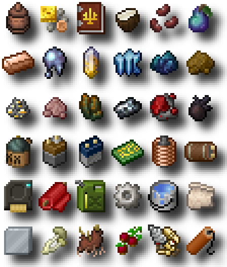

# Unused Textures

This repository contains a number of textures I've created over the years. They're not really doing me any good sitting on my hard drive so I've gathered them here for you to use. While they were originally intended for use in various never-finished or never-released mods for Minecraft, I suppose you could use them for just about anything else. Other games, an application icon, YouTube channel logo...

Most are just simple 16x16 RGBA sprites; of those that were intended to be animated, I have included accompanying `.mcmeta` files for the convenience of those interested in incorporating them into their own Minecraft mods. They vary in quality somewhat as they collectively represent approximately seven years of what I would like to believe is self-improvement.

I tried to name the textures such that any local clone of the repository would be searchable (for instance, one can search `"blob"` to get all the "blobby" textures) but I hesitate to call the naming pattern a "system"... or even a "pattern" for that matter.

I've been updating this repository every now and then as I create new textures or find more old ones, so if you've forked or cloned this, don't forget to at least do a `git fetch` every once in a while!

## Gallery View
GitHub user [oparisblue](https://github.com/oparisblue) has created the marvelous [Minecraft Textures Viewer](https://github.com/oparisblue/minecraft-textures-viewer), allowing one to view the contents of a local folder or a GitHub repository as a *searchable* image gallery! It even reads `.mcmeta` files, so animated textures mostly appear as they would in-game. If you'd like to peruse these textures through the lens of their splendid project, [simply follow this link.](https://oparisblue.github.io/minecraft-textures-viewer/#github/malcolmriley/unused-textures/master) Great for viewing repositories such as these, or for a top-level view of your modpack, or whatever other use case you can think of.

## Other Resources
This isn't the only Minecraft-ish textures repository on GitHub, so if you're looking for more or just something different, please take a look at the links below:

- [Foreck's Textures](https://github.com/Foreck1/foreck-textures)
- [FreneticScribbler's OpenTextures](https://github.com/FreneticScribbler/OpenTextures)
- [Futureazoo's TextureRepository](https://github.com/Futureazoo/TextureRepository)

---
## Policy On Special Requests
Since publishing this repository I've received a number of requests for spritework or assistance in that department, so I thought I'd add a note here regarding requests. Unfortunately my time is limited and I've got my own projects I'm tending to, so I can't always be of assistance. I hope you find the following policy to be a fair compromise:

If you (the royal you - you or your team) have a particular need and you don't see something in this repository that suits it -

**If any of the following apply:**
- You wish to retain exclusive adaptation/distribution rights to the work
- You are on a timetable and have specific deadlines
- You have a specific vision or specific aesthetic requirements
- You have many requests that need filling (I reserve the right to set this threshold)

... Then I must request compensation in return. Please send me a message at mriley.texture.inquiries@gmail.com so we can discuss further!

**On the other hand, if all of the following apply:**
- You do not mind that the produced works are publicly available for adaptation and redistribution
- You are not on a particular timetable, and are okay with being on mine
- You're okay with being at the mercy of my creative interpretations
- You're okay with me potentially turning down requests that are too large or too numerous, and either or both in too short a time frame

... Then feel free to open a discussion post on this repository, or send me a message at the above eMail. If I decide take your request, in return I must insist that the spritework I do be added to this repository as CC-BY-4.0, or that it be made publicly available with attribution and a license permitting free adaptation and redistribution. If I decide to make something for free, it will be free for everyone and on my own terms, sorry!

If you have further questions please direct them to the above eMail address.

---
The resources in this repository are available under the [Creative Commons Attribution 4.0 International License](https://creativecommons.org/licenses/by/4.0/), as per the [License](LICENSE) included.
